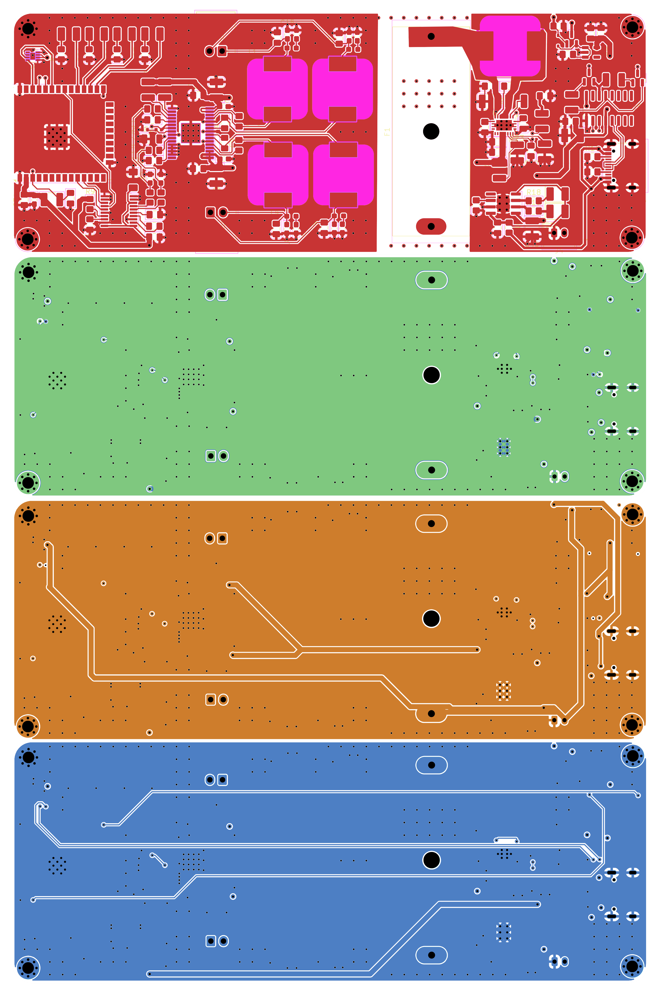
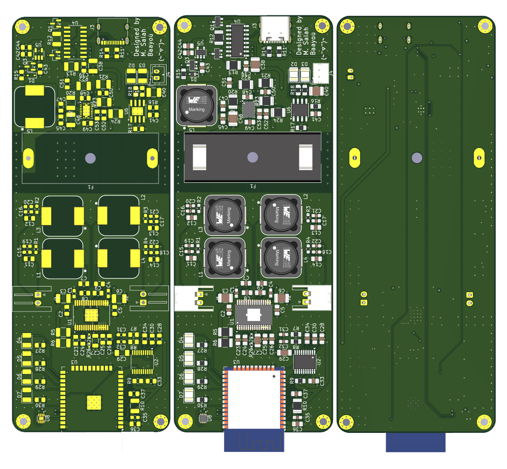
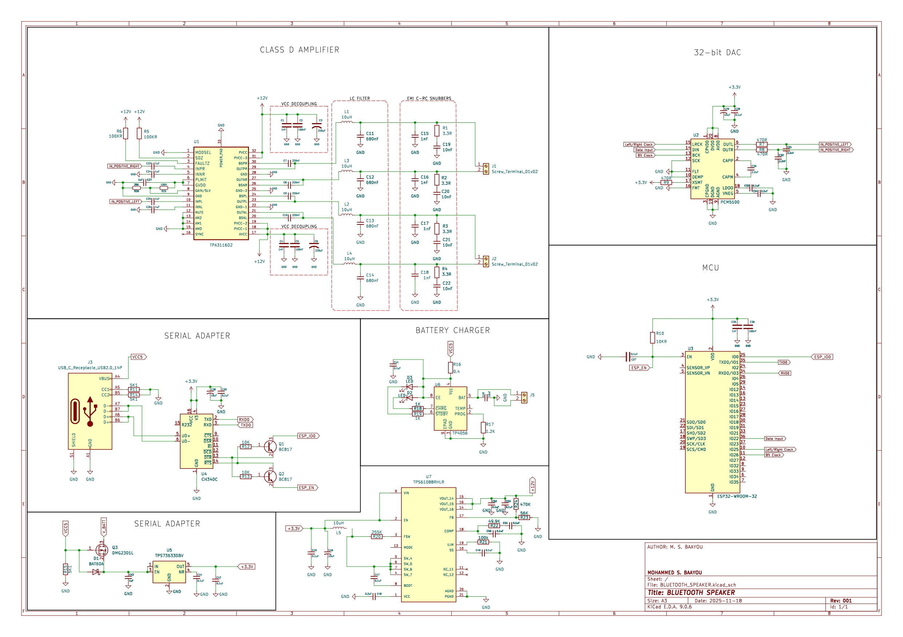

# ESP32 HiFi Bluetooth Speaker PCB Board

This project showcases the design and assembly of a **HiFi Bluetooth speaker PCB board** based on the ESP32.  
It includes PCB layer visualization, the assembled board, and BLE schematics for reference.

## 📐 PCB Layers

## 🔧 Assembled PCB

## 📊 Schematics (BLE)

